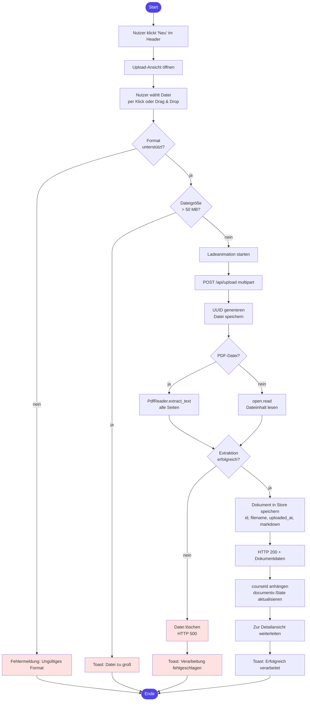
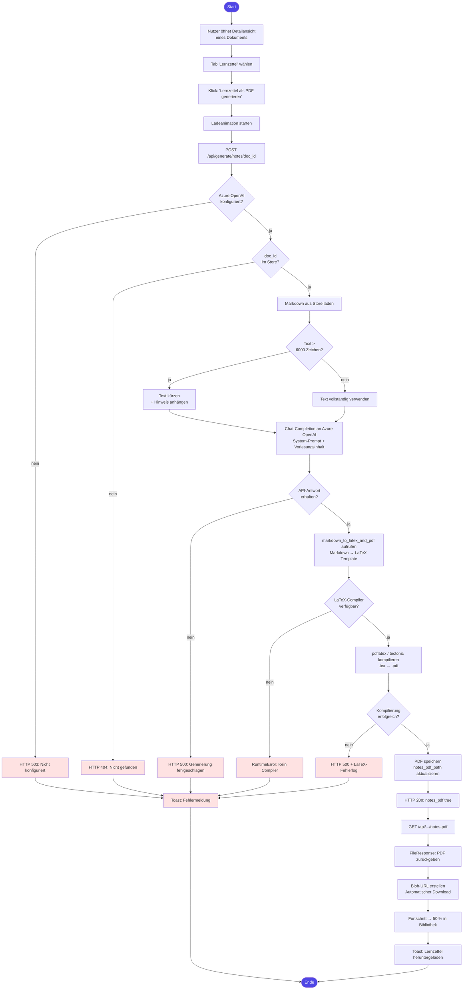

# Aktivitätsdiagramme

Die vollständigen PlantUML-Quellcodes befinden sich in `docs/plantuml_Code_AD1` (UC-01) und `docs/plantuml_Code_AD2` (UC-02).  
Die gerenderten PNG-Bilder liegen unter `docs/PlantUML/`.

---

## UC-01 – Vorlesung hochladen

**Swimlanes:** Nutzer | Frontend (React) | Backend (FastAPI)

---

## UC-02 – Lernzettel generieren

**Swimlanes:** Nutzer | Frontend (React) | Backend (FastAPI) | Azure OpenAI | LaTeX-Compiler
