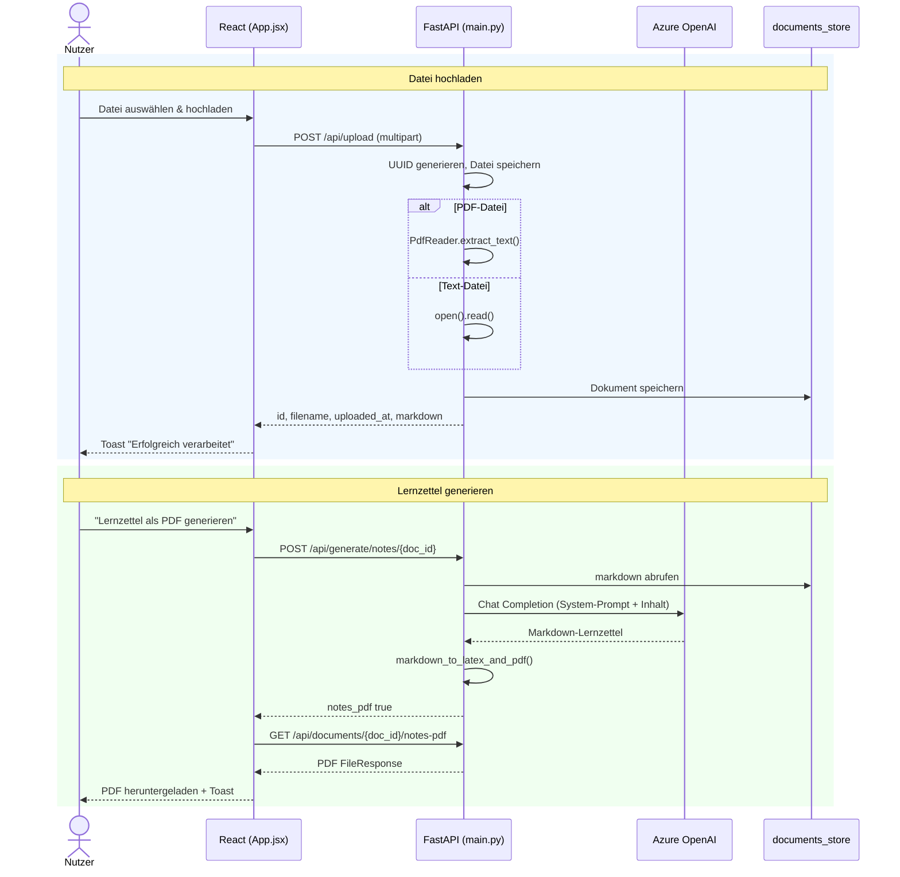

# Sequenzdiagramme – StudyBuddy

Der vollständige PlantUML-Quellcode befindet sich in `docs/Plantuml_Code_SD`.  
Das gerenderte PNG liegt unter `docs/PlantUML/Sequenzdigramm.png`.

Das Sequenzdiagramm dokumentiert die vier zentralen Interaktionsszenarien zwischen Nutzer, Frontend (React), Backend (FastAPI), Azure OpenAI und LaTeX-Compiler:

1. **Datei hochladen** – Upload, UUID-Generierung, Textextraktion, Store-Speicherung
2. **Lernzettel generieren** – KI-Anfrage, LaTeX-Kompilierung, PDF-Download
3. **Karteikarten generieren** – KI-Anfrage, JSON-Parsing, State-Update im Frontend
4. **Quiz generieren & auswerten** – KI-Anfrage, Multiple-Choice, Score-Berechnung im Frontend

