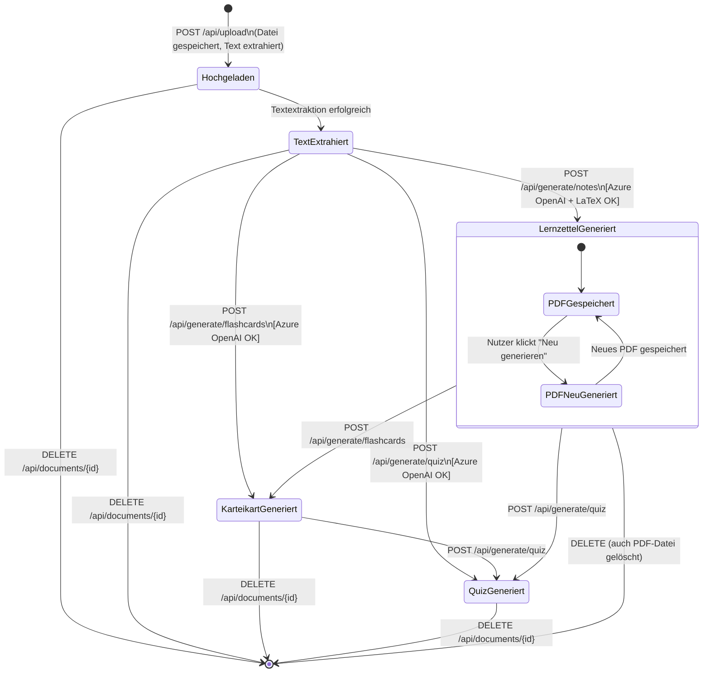

# Zustandsdiagramm – Dokument-Lebenszyklus

Das Zustandsdiagramm beschreibt, welche Zustände ein hochgeladenes Dokument innerhalb von StudyBuddy durchläuft.  
Der vollständige PlantUML-Quellcode befindet sich in `docs/plantuml_Code_ZD`.

---

---

## Zustandsbeschreibungen

| Zustand               | Beschreibung                                                                                     |
|-----------------------|--------------------------------------------------------------------------------------------------|
| **Hochgeladen**       | Datei wurde auf den Server übertragen und im `uploads/`-Verzeichnis gespeichert. Textextraktion läuft. |
| **TextExtrahiert**    | Markdown-Text liegt im `documents_store` vor. Noch kein Lernmaterial generiert.                 |
| **LernzettelGeneriert** | `notes_pdf_path` ist gesetzt. PDF-Lernzettel liegt im `uploads/`-Verzeichnis. Status in UI: 50 %. |
| **KarteikartGeneriert** | `flashcards[]` ist im Store gespeichert. Karteikarten können in der App durchgegangen werden.  |
| **QuizGeneriert**     | `quiz[]` mit Multiple-Choice-Fragen ist im Store. Vollständig verarbeitetes Dokument.            |

## Übergangsbedingungen

| Von → Nach                       | Auslöser                                      | Bedingung                               |
|----------------------------------|-----------------------------------------------|-----------------------------------------|
| Hochgeladen → TextExtrahiert     | Upload abgeschlossen                          | Textextraktion ohne Fehler              |
| TextExtrahiert → LernzettelGeneriert | Nutzer klickt "Lernzettel generieren"    | Azure OpenAI + LaTeX konfiguriert und verfügbar |
| LernzettelGeneriert → PDFNeuGeneriert | Nutzer klickt "Neu generieren"          | Azure OpenAI + LaTeX verfügbar          |
| Beliebig → [Gelöscht]            | Nutzer klickt "Löschen" in Detailansicht      | Keine                                   |
