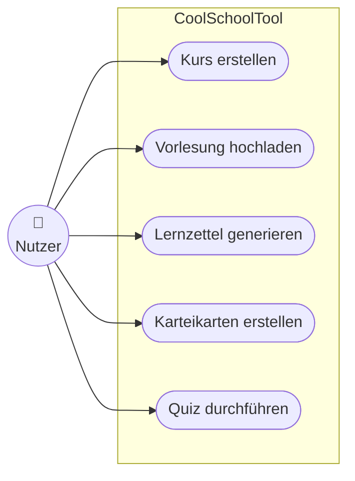

```mermaid
flowchart LR
  U(("👤\nNutzer"))

  subgraph System ["  CoolSchoolTool  "]
    A([Kurs erstellen])
    B([Vorlesung hochladen])
    C([Lernzettel generieren])
    D([Karteikarten erstellen])
    E([Quiz durchführen])
  end

  U --> A
  U --> B
  U --> C
  U --> D
  U --> E
```
