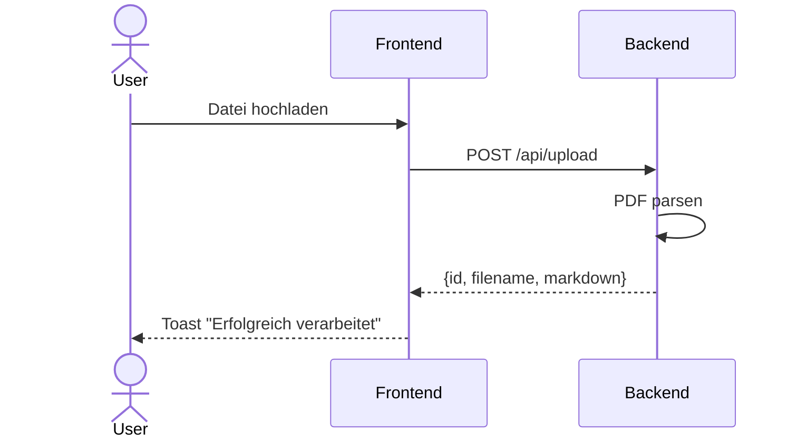

```mermaid
sequenceDiagram
  actor User
  User->>Frontend: Datei hochladen
  Frontend->>Backend: POST /api/upload
  Backend->>Backend: PDF parsen
  Backend-->>Frontend: {id, filename, markdown}
  Frontend-->>User: Toast "Erfolgreich verarbeitet"
```
